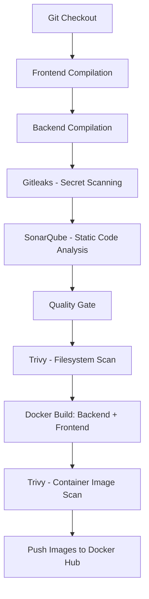
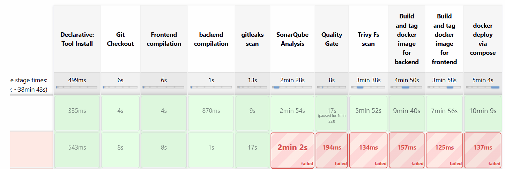

# 3-Tier DevSecOps Project

A production-style 3-tier web application (React → Node.js/Express → MySQL) deployed through a fully self-built DevSecOps CI/CD pipeline — covering secret scanning, static code analysis, container vulnerability scanning, infrastructure-as-code, and Kubernetes, with role-based access control across the team workflow.

> **Attribution:** This project was originally forked from [jaiswaladi246/3-Tier-DevSecOps-Mega-Project](https://github.com/jaiswaladi246/3-Tier-DevSecOps-Mega-Project) as a base application. All CI/CD pipeline design, infrastructure provisioning, security tooling integration, debugging, and DevOps/DevSecOps implementation in this repository were independently built and configured from scratch.

---

## 📂 Repository Structure

```
.
├── api/              # Node.js/Express backend
├── client/           # React frontend
├── k8s-dev/          # Kubernetes manifests (RBAC, deployments)
├── Jenkinsfile        # CI/CD pipeline definition
├── docker-compose.yaml
└── mysql-init/        # Database schema/init scripts

---

## 🏗️ Infrastructure Provisioning

The Jenkins and SonarQube servers can be provisioned locally using the provisioning directory with Vagrant + VirtualBox.

provisioning/
├── Jenkins/
└── SonarQube/

The provisioning setup creates dedicated VMs for Jenkins and SonarQube and configures the required tools and services.

The same environment can also be deployed on AWS EC2 instances, where Jenkins and SonarQube can be installed and configured on separate EC2 instances.

---

## 🧱 Application Stack

| Layer | Technology |
|---|---|
| Frontend | React |
| Backend | Node.js / Express REST API |
| Database | MySQL 8 |
| Auth | JWT-based authentication |


---

## 🚀 CI/CD Pipeline Overview

Built entirely in **Jenkins** (declarative pipeline), running on a self-provisioned VM, with a dedicated SonarQube server on a second VM — both provisioned via **Vagrant + VirtualBox**, networked together on a private subnet.



### Pipeline Stages

1. **Git Checkout** — pulls source from the organization repository
2. **Compilation Checks** — frontend and backend JavaScript syntax validation
3. **Gitleaks** — scans the codebase for hardcoded secrets and credentials before anything else runs
4. **SonarQube Analysis** — static code analysis for code quality and maintainability, gated by a **Quality Gate** step wired via a **Jenkins ↔ SonarQube webhook** across the private VM network
5. **Trivy (Filesystem)** — vulnerability scan of dependencies and source files
6. **Docker Build** — builds backend and frontend images
7. **Trivy (Image)** — scans the built container images for known CVEs before they're published
8. **Docker Hub Push** — publishes versioned images
9. **Deployment** — via Docker Compose (local/VM), with a parallel path to Kubernetes (see below)

---

## 🏗️ Infrastructure

- **Jenkins VM** — Ubuntu 22.04, provisioned via Vagrant, with Java, Jenkins, Docker, Terraform, and AWS CLI installed via an idempotent shell provisioner
- **SonarQube VM** — Ubuntu 22.04, provisioned via Vagrant, running SonarQube (Community Build) with a PostgreSQL backend and an Nginx reverse proxy
- **Private networking** — both VMs communicate over a dedicated VirtualBox host-only network, enabling the SonarQube→Jenkins webhook callback required for quality gate enforcement
- **Secrets scanning** — Gitleaks integrated as a hard pipeline gate
- **Container scanning** — Trivy integrated at both the filesystem and image layers

---

## 🛡️ Security Practices Implemented

- **Secret scanning** (Gitleaks) — blocks the pipeline on hardcoded credentials
- **Static Application Security Testing / SAST** (SonarQube) — enforced via a Quality Gate before deployment can proceed
- **Software Composition Analysis** (Trivy filesystem scan) — flags vulnerable dependencies
- **Container image scanning** (Trivy image scan) — flags CVEs in built images before publishing
- **RBAC** — least-privilege access both at the GitHub organization level and within the Kubernetes namespace
- **No hardcoded cloud credentials** — AWS auth handled via CLI profiles, never embedded in Terraform files

---

## 📸 Screenshots

### Jenkins CI/CD Pipeline



---
